# Software Dev - Databases - Notes & Misc 💽

#### Cardinality & Modality

_Cardinality_ defines the range of object-to object Relationships. Expected values are 1:1, 1:N, N:M

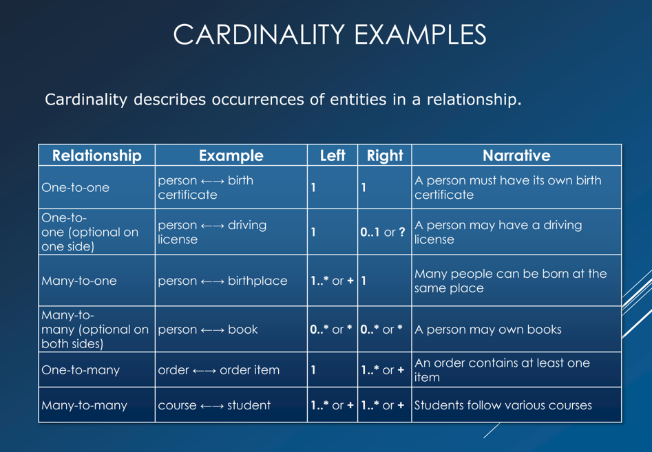

_Modality_ indicates wether or not a relationship between objects is mandatory. Expected values are 0 or 1 only.

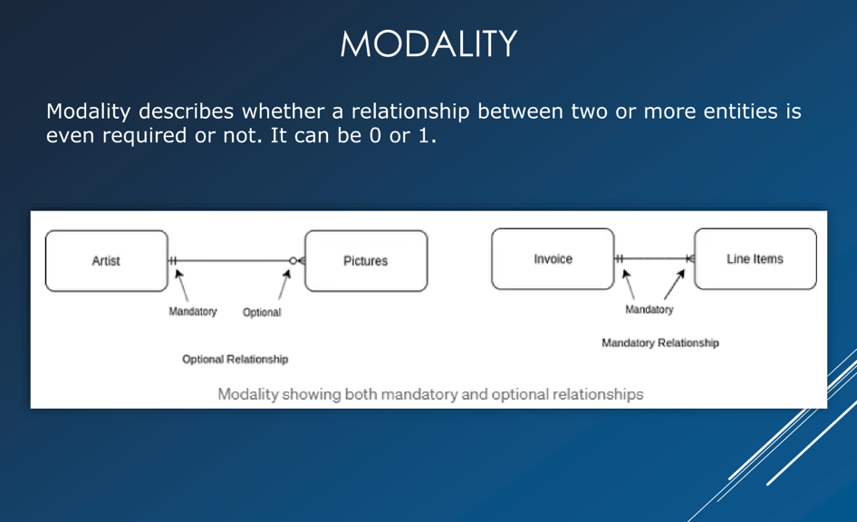

---

<br>

# Normalization

**1. Normal form**

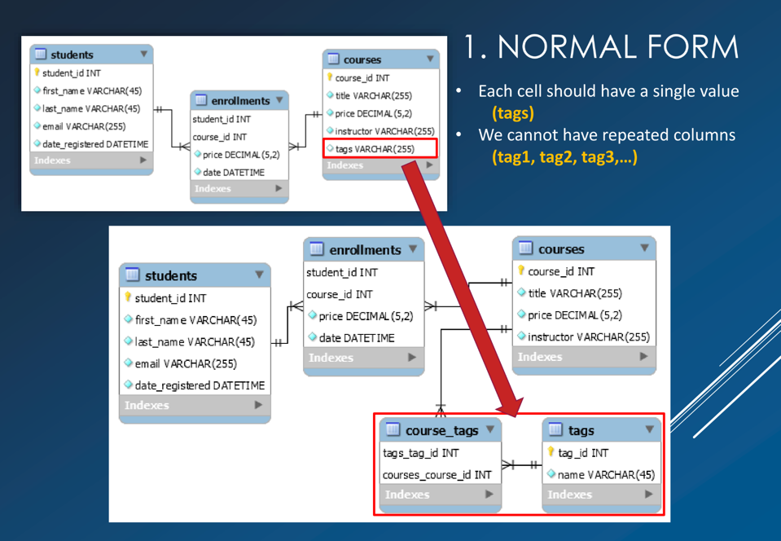

---

**2. Normal form**

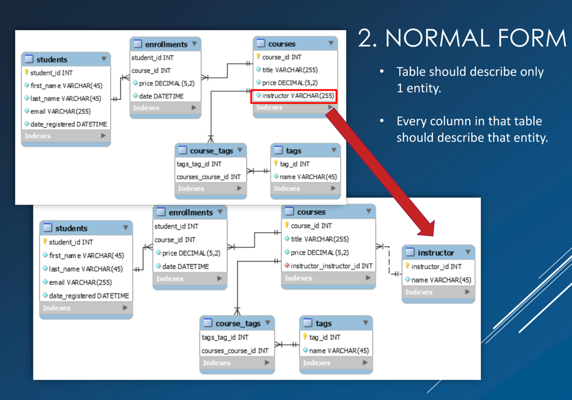

---

**3. Normal form**

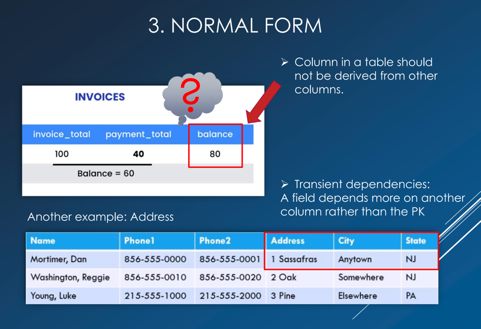

---

<br>

# ERD Entity Relational Diagram

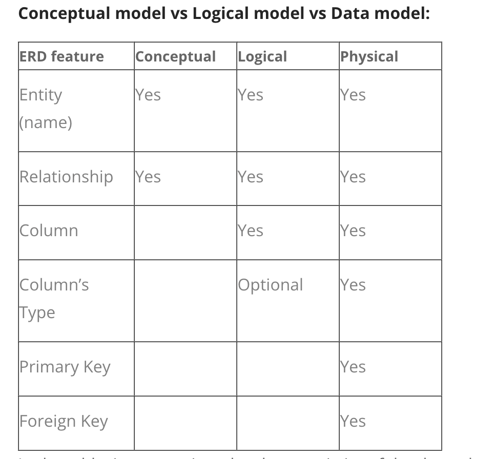

---

<br>

# Gemini's take on ACID 🎇

**Atomicity**: All operations within a transaction either complete successfully or are entirely rolled back, preventing
partial updates

**Consistency**: Transactions move the database from one valid state to another, maintaining data integrity and rules.

**Isolation**: Concurrent transactions do not interfere with each other, appearing to execute in isolation.

**Durability**: Once a transaction is committed, its changes are permanent and survive system failures.

_ACID_ properties ensure high data integrity and reliable transactions, crucial for applications like financial systems
where data accuracy is paramount.
Common in traditional relational databases (_MySQL_, _PostgreSQL_) and increasingly supported by some _NoSQL_
databases (_MongoDB_, _RavenDB_) for multi-document transactions. Implementing full _ACID_ can add complexity and cost.

---

<br>

## Triggers

**🔹 What Triggers Do**

A trigger in MySQL is a piece of logic that automatically runs before or after an INSERT, UPDATE, or DELETE on a table.
They’re useful for:

Data consistency (enforcing rules beyond simple constraints)

Auditing (keeping a history of changes)

---


## Stored Procedures

### 🔹 Why Stored Procedures Exist

Stored procedures are essentially:

Reusable server-side logic that runs inside MySQL.

They’re great when you want to encapsulate business rules or heavy operations in the DB, so every client/app doesn’t
have to duplicate the logic.

They can reduce network round-trips (one procedure call instead of many small queries).

---

### 🔹 Where They Could Be Used in Munchora

#### _1._ Generating a User’s Grocery List

Suppose you want to build a grocery list from all recipes a user selected.

Without a procedure: your backend has to query ingredients, sum quantities, normalize units, and then insert into
grocery_lists.

With a procedure: you could encapsulate that logic in sp_generate_grocery_list(user_id).

Input: user_id

Logic: aggregate ingredients across recipes, handle duplicates, convert units

Output: rows in grocery_list_items

This makes the logic consistent and reusable no matter which part of the app calls it.

#### _2._ Calculating Nutrition Totals

Suppose you want to calculate calories, protein, etc. across all recipes in a user’s plan.

A procedure sp_calculate_nutrition(plan_id) could:

Join recipes + ingredients + nutrition info

Sum totals

Store results in a summary table

Now, instead of repeating a heavy multi-join query in Rails/React Native, you just call the procedure.

#### _3._ Audit Logging

Imagine you want to track every time a grocery list is updated (for future “undo” features or analytics).

A procedure sp_update_grocery_item(item_id, new_qty) could:

Update the item

Insert a row into grocery_list_audit automatically

This guarantees that every update also logs history — can’t be skipped by accident in app code.

---

### 🔹 When NOT to Use Stored Procedures

If the logic is simple CRUD (insert, update, delete) → keep it in Rails.

If logic changes frequently → easier to maintain in application code.

If portability matters → procedures are MySQL-specific (locks you in).

---

<br>

# MISC

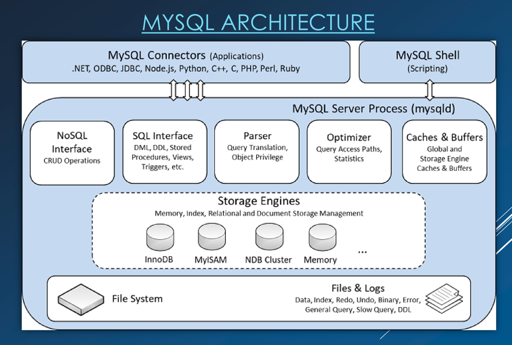

---

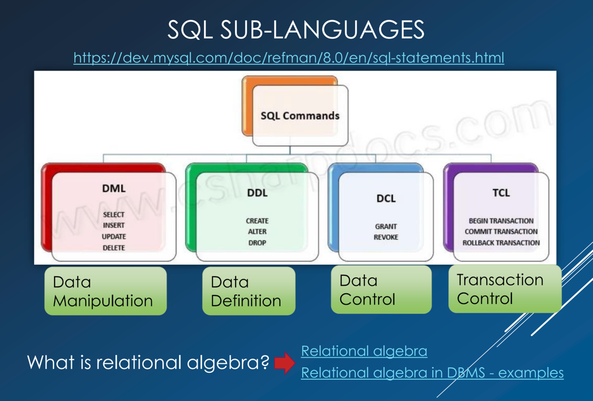

_(Links provided here)_

[Chapter 15 SQL Statements](https://dev.mysql.com/doc/refman/8.0/en/sql-statements.html)

[Relational Algebra](https://en.wikipedia.org/wiki/Relational_algebra#Left_outer_join_.28.E2.9F.95.29)

[Relational Algebra in DBMS: Operations with Examples](https://www.guru99.com/relational-algebra-dbms.html)

---


---

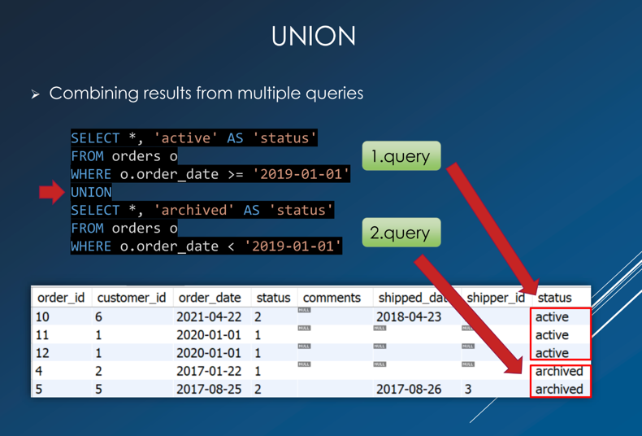

---

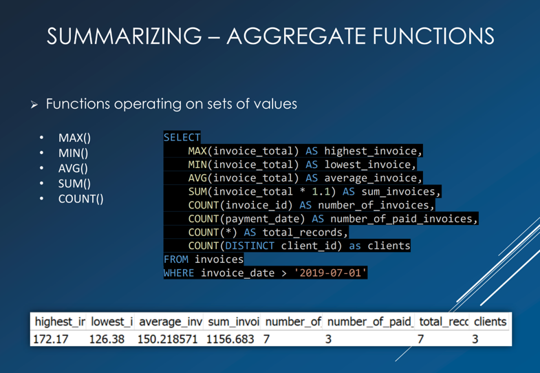

---

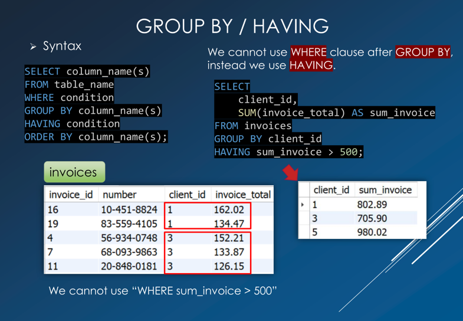

---

<br>

# SQL commands

Essential and important _sql_ commands

```sql
-- Show all databases
SHOW
DATABASES;

-- Select a database
USE
database_name;

-- Show all tables in the selected database
SHOW
TABLES;

-- Describe a table structure
DESCRIBE table_name;

-- Show create table statement
SHOW
CREATE TABLE table_name;

-- Show indexes of a table
SHOW
INDEX FROM table_name;

-- Show current database
SELECT DATABASE();

-- Show all columns of a table
SHOW
COLUMNS FROM table_name;

-- Show table status (engine, rows, etc.)
SHOW
TABLE STATUS;

-- Show all foreign keys for a table
SELECT TABLE_NAME,
       COLUMN_NAME,
       CONSTRAINT_NAME,
       REFERENCED_TABLE_NAME,
       REFERENCED_COLUMN_NAME
FROM INFORMATION_SCHEMA.KEY_COLUMN_USAGE
WHERE TABLE_SCHEMA = 'database_name'
  AND TABLE_NAME = 'table_name'
  AND REFERENCED_TABLE_NAME IS NOT NULL;
```

---

<br>

# Links

[ERD, Cardinality, Relations, etc. explained](https://www.lucidchart.com/pages/er-diagrams)

---

```text
Peter Chen, who developed entity-relationship modeling and published his work in 1976,
was one of the pioneers of using the entity relationship concepts in software and
information system modeling and design.
The Chen ERD notation is still used and is considered to present a 
more detailed way of representing entities and relationships.
```

[Chen Notation](https://vertabelo.com/blog/chen-erd-notation/)

---

```text
The most recognizable characteristic of crow’s foot notation (also known as IE notation)
is that it uses graphical symbols to indicate the ‘many’ side of the relationship.
The three-pronged ‘many’ symbol is also how this widely-used notation style got its name.
Let’s see where crow’s foot is placed in the history of data modeling and
take a look at its symbols.
```

[Crows Foot Notation](https://vertabelo.com/blog/crow-s-foot-notation/)

---

[Sample Databases - MySQL](https://www3.ntu.edu.sg/home/ehchua/programming/sql/SampleDatabases.html)

[Guide To Design Database For Inventory Management System In MySQL](https://www.tutorials24x7.com/mysql/guide-to-design-database-for-inventory-management-system-in-mysql)

[Best practices for modeling relational data in DynamoDB](https://docs.aws.amazon.com/amazondynamodb/latest/developerguide/bp-relational-modeling.html)