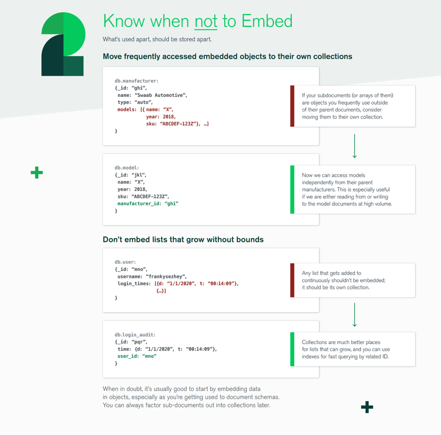

# Software Dev - Databases - Notes & Misc 💽

#### Cardinality & Modality

_Cardinality_ defines the range of object-to object Relationships. Expected values are 1:1, 1:N, N:M


_Modality_ indicates wether or not a relationship between objects is mandatory. Expected values are 0 or 1 only.


---

<br>

# Normalization

**1. Normal form**


---

**2. Normal form**


---

**3. Normal form**


---

<br>

# ERD Entity Relational Diagram


---

<br>

# Gemini's take on ACID 🎇

**Atomicity**: All operations within a transaction either complete successfully or are entirely rolled back, preventing
partial updates

**Consistency**: Transactions move the database from one valid state to another, maintaining data integrity and rules.

**Isolation**: Concurrent transactions do not interfere with each other, appearing to execute in isolation.

**Durability**: Once a transaction is committed, its changes are permanent and survive system failures.

_ACID_ properties ensure high data integrity and reliable transactions, crucial for applications like financial systems
where data accuracy is paramount.
Common in traditional relational databases (_MySQL_, _PostgreSQL_) and increasingly supported by some _NoSQL_
databases (_MongoDB_, _RavenDB_) for multi-document transactions. Implementing full _ACID_ can add complexity and cost.


---

# Deepseek on BASE

### BASE Properties

_BASE_ is a model that emerged with modern _NoSQL_ databases (like Cassandra, MongoDB, DynamoDB) and distributed
systems.
It prioritizes availability and scalability over immediate consistency.

**_BA - Basically Available_**
Concept: The system guarantees that it will respond to every request (even if it's a failure message). The system
remains available for reading and writing, even during failures, perhaps by degrading performance or showing stale data.

Example: If a node in a distributed database cluster fails, the system will still handle your read/write requests using
the other available nodes, even if the data on those nodes isn't the very latest.

**_S - Soft State_**

Concept: The state of the system may change over time, even without input (e.g., during the process of replication and
achieving eventual consistency). The data is not immediately consistent across all nodes.

Example: After you update your profile picture, different users might see the old picture for a short period until the
change is replicated to all servers around the world.

**_E - Eventual Consistency_**

Concept: The system guarantees that if no new updates are made to a given data item, eventually all accesses to that
item will return the last updated value. Given enough time, all replicas will become consistent.

Example: This is the "processing" state in a payment app. Your friend's account doesn't show the money instantly, but
after a few seconds or minutes, it will appear. The system eventually becomes consistent.

## Deepseek - ACID vs BASE

**_ACID_** is like a traditional bank teller. The transaction is all-or-nothing. The money is deducted from one account
and
added to the other instantly and guaranteed. You wait for the confirmation before leaving the counter. It's consistent
and safe.

**_BASE_** is like writing a check or using a modern payment app. The transaction is eventual. The app might say "
payment
processing." The money leaves your account now, but it might take a few seconds, minutes, or even hours to show up in
the recipient's account. The system is highly available and fast for you, with the promise that it will become
consistent later. It's fast and available.

---

<br>

# SQL

## Triggers

**🔹 What Triggers Do**

A trigger in MySQL is a piece of logic that automatically runs before or after an INSERT, UPDATE, or DELETE on a table.
They’re useful for:

Data consistency (enforcing rules beyond simple constraints)

Auditing (keeping a history of changes)

**Example of preventing negative _servings_ for Munchora _recipes_**

```mysql
CREATE TRIGGER validate_recipe_servings
    BEFORE INSERT
    ON recipes
    FOR EACH ROW
BEGIN
    IF NEW.servings < 1 THEN
        SIGNAL SQLSTATE '45000'
            SET MESSAGE_TEXT = 'Servings must be at least 1';
    END IF;
END;
```

This will throw an error if someone tries:

```mysql
INSERT INTO recipes (user_id, title, servings)
VALUES ('123', 'Pizza', -5);
```

### 🔹 Example: Auditing Trigger for Munchora - Recipes

Let’s say you want to keep a history of updates (title, description, etc.) for versioning or “undo” functionality.

First, create an audit table:

```ruby
create_table :recipe_audits, id: :bigint do |t|
  t.string :recipe_id, limit: 36, null: false
  t.string :user_id, limit: 36, null: false
  t.string :action, null: false # 'INSERT' | 'UPDATE' | 'DELETE'
  t.json :old_data
  t.json :new_data
  t.timestamps
end
```

Then, add a trigger:

```ruby
execute <<~SQL
  CREATE TRIGGER after_recipe_update
  AFTER UPDATE ON recipes
  FOR EACH ROW
  BEGIN
    INSERT INTO recipe_audits (recipe_id, user_id, action, old_data, new_data, created_at, updated_at)
    VALUES (
      OLD.id,
      OLD.user_id,
      'UPDATE',
      JSON_OBJECT(
        'title', OLD.title,
        'description', OLD.description,
        'instructions', OLD.instructions,
        'tags', OLD.tags
      ),
      JSON_OBJECT(
        'title', NEW.title,
        'description', NEW.description,
        'instructions', NEW.instructions,
        'tags', NEW.tags
      ),
      NOW(),
      NOW()
    );
  END;
SQL

```

---

## Stored Procedures

### 🔹 Why Stored Procedures Exist

Stored procedures are essentially:

Reusable server-side logic that runs inside MySQL.

They’re great when you want to encapsulate business rules or heavy operations in the DB, so every client/app doesn’t
have to duplicate the logic.

They can reduce network round-trips (one procedure call instead of many small queries).

---

### 🔹 When NOT to Use Stored Procedures

If the logic is simple CRUD (insert, update, delete) → keep it in Rails.

If logic changes frequently → easier to maintain in application code.

If portability matters → procedures are MySQL-specific (locks you in).

---

<br>

# MISC

## SQL Indexes

MySQL / InnoDB uses B+TREE (combination of B-TREE and doubly linked list) for keeping control of indexes 


---

To track how a query runs use `EXPLAIN`


---

Comparison for different data structures insertion, lookup and deletion/update times:


---

<br>

## Transactions

In MySQL, a transaction is a sequence of one or more SQL statements executed as a single unit, ensuring atomicity,
consistency, isolation, and durability (ACID). It starts with `START TRANSACTION` and end with `COMMIT` to save changes
or `ROLLBACK` to undo them.
Transactions can include `SAVEPOINTs` for partial rollback, and their behavior with concurrent
access is controlled by isolation levels and locks. They are crucial for maintaining data integrity in multi-step or
concurrent operations.

## Transactional isolation level

Isolation is one of the four **ACID** properties of _database transactions_:

It defines how visible uncommitted changes are to other concurrent transactions.

In other words:

Isolation controls how and when the effects of one transaction become visible to others.

If multiple users (or threads) are reading and writing to the same data at the same time,
the isolation level determines how “independent” those transactions are from one another.

| Isolation Level      | Prevents Dirty Reads | Prevents Non-Repeatable Reads | Prevents Phantom Reads | Description                                                                                 | Typical locking behavior in MySQL (InnoDB)                                                                          |
|----------------------|----------------------|-------------------------------|------------------------|---------------------------------------------------------------------------------------------|---------------------------------------------------------------------------------------------------------------------|
| **READ UNCOMMITTED** | ❌                    | ❌                             | ❌                      | Transactions can read uncommitted (dirty) data. Fastest, least safe.                        | **No read locks (shared locks), minimal write locks**                                                               |
| **READ COMMITTED**   | ✅                    | ❌                             | ❌                      | Each query sees only committed data, but the same query may return different results later. | **Shared locks only held while reading, write locks still held until commit**                                       |
| **REPEATABLE READ**  | ✅                    | ✅                             | ❌                      | Ensures that if you re-read a row, it stays the same within your transaction.               | **Shared locks held for the duration of transaction (next reads see the same data), write locks held until commit** |
| **SERIALIZABLE**     | ✅                    | ✅                             | ✅                      | Transactions are fully isolated; executed as if one after another. Safest, but slowest.     | **Reads acquire shared locks, writes acquire exclusive locks; transactions behave as if executed sequentially**     |

### Explicit locks to use

```sql
# ============
# table locks
# ============
# shared lock
LOCK TABLES table_name READ;
# exclusive lock
LOCK TABLES table_name WRITE;

# ============
# row locks
# ============
# shared lock = multiple can read, no one can write
SELECT *
FROM orders
WHERE id = 123 LOCK IN SHARE MODE;

# exclusive lock = only one can write, others blocked from reading/writing.
SELECT *
FROM orders
WHERE id = 123 FOR
UPDATE;
```

---

### Savepoints for transactional state

A SAVEPOINT in MySQL is a way to create a named point within a transaction that you can roll back to without rolling
back the entire transaction. Think of it as a “bookmark” inside a transaction.

```sql
START TRANSACTION;

INSERT INTO orders (id, product)
VALUES (1, 'Apple'); -- Step 1

SAVEPOINT step1_done;

INSERT INTO orders (id, product)
VALUES (2, 'Banana');
-- Step 2

-- something goes wrong
ROLLBACK TO SAVEPOINT step1_done; -- Undo Step 2 only

INSERT INTO orders (id, product)
VALUES (3, 'Cherry'); -- Step 3

COMMIT; -- Only Step 1 and Step 3 are committed
```

---

<br

## Partitioning

Partitioning a relational database means splitting a single large table into smaller,
more manageable chunks (partitions), but keeping them logically as one table for queries.

[How to Partition Your Tables in MySQL](https://planetscale.com/blog/what-is-mysql-partitioning#how-to-partition-your-tables-in-mysql)

### Benefits

1. **Performance on Large Tables**
    - Queries filtering partition key can scan only relevant partition instead of the entire table (partition pruning).
        - Most useful for range queries (e.g., dates) or list queries (e.g., region IDs).

2. **Easier Data Management**
    - Old partitions can be dropped or archived quickly (e.g., drop last year’s data instead of deleting row by row).
    - Adding new partitions can prepare a table for future data without heavy **ALTER** operations.

3. **Parallelism**
    - MySQL can sometimes process queries in parallel across partitions.
    - Indexes inside partitions are smaller, which can improve cache efficiency.

4. **Maintenance**
    - Maintenance operations (rebuild, optimize, backup) can be done per partition instead of the entire table.

### Trade-offs / Limitations

1. **Limited Indexing Options**
    - Only indexes that include the partition key are allowed.
    - **_No foreign keys in partitioned tables._**
        - Partitioning a table, MySQL doesn’t really store it as one physical table. Instead, each partition is
          essentially its own separate table, with its own data and indexes.
        - Foreign keys, however, require a single, consistent relational structure where the engine can enforce
          constraints across all rows.

2. **Complexity**
    - Adds operational overhead (planning partitions, adjusting them as data grows).
    - If you pick the wrong partitioning strategy, queries might perform worse.

3. **Not Always Needed**
    - If your data set fits comfortably in memory or your queries don’t filter by partition keys, partitioning won’t
      help.

4. **No automatic rebalancing**
    - Unlike sharding, partitioning is still inside one server. If the server is overloaded, partitioning alone won’t
      solve scalability.

---

### Inner Workings of InnoDB (MySQL default Storage Engine)

**Normal (non-partitioned table)**

- Stored in a single `.ibd` file (_tablespace_ / in _InnoDB_, that means a single `.ibd` file).
- All rows share the same data pages and indexes.
- Queries always traverse one global structure.

**Partitioned table**

- Split into multiple partitions, each with its own `.ibd` file, pages, and indexes.
- Rows are routed to a partition based on the partition key.
- Queries can skip entire partitions (partition pruning), making lookups and maintenance faster.

---

## Sharding

Sharding = splitting one logical database into multiple physical databases (shards),
usually across multiple servers.

[Database Sharding in MySQL a guide](https://dev.to/wallacefreitas/database-sharding-in-mysql-a-comprehensive-guide-2hag)

There are several ways to shard a database,
and the strategy you choose will depend on your specific use case.
The two most common sharding strategies are range-based sharding and hash-based sharding.

To enable **sharding**, you need a **_shard router_** (also called a **_shard manager_**)
that directs all incoming queries to the correct **MySQL** instance within the **shard cluster**.

### Pros

- Horizontal scaling – Distribute data across multiple servers, avoiding single-server bottlenecks.
- Improved performance – Each shard contains fewer rows, making queries, inserts, and indexes faster.
- Increased storage capacity – Total database size can exceed what one server can handle.
- Fault isolation – If one shard fails, others can continue operating.
- Parallel processing – Some operations can run concurrently across shards.

### Cons

- Increased complexity – App or middleware must route queries correctly; schema changes must be applied across shards.
- No global foreign keys – Referential integrity cannot be enforced across shards.
- Cross-shard queries are difficult – Joins or aggregates across shards require manual merging or fan-out queries.
- Rebalancing challenges – Adding/removing shards requires moving data and updating routing logic.
- Operational overhead – More servers, monitoring, backups, and failover management are required.
- Transactions across shards are tricky – Multi-shard transactions often need two-phase commits or application-level
  handling.


---

## Replication

Replication is the process of copying and maintaining the same data across multiple database servers.

- **Purpose**
    - _High availability_: If one server fails, others can continue serving data.
    - _Read scalability_: Reads can be distributed across replicas.
    - _Disaster recovery_: Protects against data loss.


- **How it works**
    - _Primary/secondary (master/slave)_: One primary server handles writes; secondaries replicate data from it.
    - _Multi-master replication_: Multiple nodes can accept writes (more complex).

**Relation to Partitioning / Sharding**

_Replication_ is **NOT** the same as _sharding_, but they are often used together:

- **_Sharding/Partitioning_**: Splits a dataset across multiple servers to scale writes and storage horizontally.
- **_Replication_**: Copies each shard (or the entire database) to multiple nodes to increase reliability and read
  capacity.


<br>

---

# NoSQL | MongoDB

_NoSQL_ means **_not only SQL_**


MongoDB can be hosted locally using the **_CommunityServer_** or else _MongoDB_
is available through cloud using **_MongoDB Atlas_**


[MongoDB Security Checklist](https://www.mongodb.com/docs/manual/administration/security-checklist/)

### MongoDB Features

- **Indexes**
    - Special data structures that speed up queries by avoiding full collection scans.
    - Can be single-field, compound, text, geospatial, or unique
- **Views**
    - Read-only virtual collections defined by an aggregation query.
    - Do not store data, just present it in a specific format.
- **Materialized Views**
    - Precomputed, stored results of a query for faster reads.
    - MongoDB doesn’t have native materialized views,
      but you can simulate them using collections + scheduled aggregation pipelines.
- **Transactions**
    - Ensure atomic operations across multiple documents or collections.
    - Supports ACID properties in replica sets or sharded clusters.
- **Security**
    - Controls access to your database via authentication, roles, and permissions.
    - Supports encryption at rest, TLS, auditing, and field-level encryption.
- **Time Series Collections**
    - Optimized for storing time-stamped data efficiently.
    - Minimizes storage and indexing overhead for sequential, high-volume data.
- **Triggers/Events**
    - React automatically to database changes (like SQL triggers).
    - In MongoDB, typically implemented via Change Streams or Realm Functions.
- **Change Streams**
    - Let applications listen for inserts, updates, deletes in real time.
    - Useful for event-driven apps, caching, and push notifications.
- **Aggregations Pipelines**
    - Powerful data processing framework using stages ($match, $group, $project, etc.).
    - Transforms, filters, and aggregates documents efficiently.
- **Lookup**
    - Performs a left join between collections within an aggregation pipeline.
    - Allows combining related documents, replacing SQL foreign key joins.

No **_Stored Procedures_** in **_MongoDB_**

MongoDB do have stored functions, but they're not recommended

----

#### MongoDB Atlas Cloud vs Self-hosting

Relying on _MongoDB Atlas cloud_ provides automatic 3-node replica set where if self-hosted it has
to be configured manually (simple version orchestrator is missing):

```yml
# docker-compose.yml for replica set
version: '3.8'
services:
  mongo1:
    image: mongo:5.0
    command: [ "--replSet", "rs0", "--bind_ip_all" ]

  mongo2:
    image: mongo:5.0
    command: [ "--replSet", "rs0", "--bind_ip_all" ]

  mongo3:
    image: mongo:5.0
    command: [ "--replSet", "rs0", "--bind_ip_all" ]
```

---

### Document Schema Design





---


---

<br>

## No SQL Graph DB

The main reason for graph databases is that relational db's lack relations.
For RDBMS JOIN operations can be very memory intensive.

For graph db faster and more economical queries.
Relationships are already predetermined based on connected nodes.

For document oriented dbs they also do lack the relationships such as friends, friends.
To determine which customers bought a given product a full scan of the customers is
required if the orders are embedded within customer object.

Ruby on Rails app relies on Bolt for neo4j connection just like SQL mosty relies on TCP.
Bolt is Neo4j’s binary network protocol for communication between clients and the database.


### APOC (Awesome Procedures On Cypher)

A powerful Neo4j plugin extending Cypher with hundreds of utility functions and procedures for data import/export,
graph refactoring, path finding, and schema operations. It enhances Cypher’s expressiveness with commands like
apoc.create.node, apoc.refactor.mergeNodes, and apoc.convert.toJson. Common uses include batch updates, dynamic queries,
and integrating external data sources. APOC is essential for advanced data manipulation, automation, and maintenance
within Neo4j.

APOC is also providing utilities such as triggers and events.

**Node** → roughly like a table row or document; represents an entity (e.g., User, Recipe).

**Label** → roughly like a table or collection; nodes with the same label share a type (:User).

**Property** → roughly like a field or attribute; key-value pair stored on a node or relationship (name, email).

**Relationship** → edges connecting nodes; can also have properties (like a row in a join table).

**Constraint** → similar to unique/primary key in relational DBs (e.g., id must be unique).

**Index** → speeds up lookups on node properties.

_Embedded/Foreign key concepts don’t really exist; graph relationships replace them._

### Relations in Neo4j

_Neo4j_ allows to define any relationship type - they're completely custom to a given domain.

**Direction specifiers in Neo4j define relationship orientation:**

- `:out` = From current node to others
- `:in` = From others to current node
- `:both` = Either direction (bidirectional)

However, there are some common patterns and categories that emerge.
Here are the main types of relationships with examples:

**Common Relationship Categories Summary**

| Category      | Example Relationships                      |
|---------------|--------------------------------------------|
| Social        | `:FRIENDS_WITH` `:FOLLOWS` `:CONNECTED_TO` |
| Professional  | `:WORKS_FOR` `:MANAGES` `:COLLEAGUE_OF`    |
| Content       | `:LIKED` `:SHARED` `:CREATED` `:VIEWED`    |
| Spatial       | `:LOCATED_IN` `:NEAR` `:CONTAINS`          |
| Temporal      | `:BEFORE` `:AFTER` `:DURING`               |
| Causal        | `:CAUSES` `:LEADS_TO,` `:DEPENDS_ON`       |
| Transactional | `:PURCHASED` `:OWNS` `:SOLD_TO`            |

---

<br>

## DB Terminology


---


_(Links provided here)_

[Chapter 15 SQL Statements](https://dev.mysql.com/doc/refman/8.0/en/sql-statements.html)

[Relational Algebra](https://en.wikipedia.org/wiki/Relational_algebra#Left_outer_join_.28.E2.9F.95.29)

[Relational Algebra in DBMS: Operations with Examples](https://www.guru99.com/relational-algebra-dbms.html)

---


---


---


---


---

<br>

# SQL commands

Essential and important _sql_ commands

```sql
-- Show all databases
SHOW
    DATABASES;

-- Select a database
USE
    database_name;

-- Show all tables in the selected database
SHOW
    TABLES;

-- Describe a table structure
DESCRIBE table_name;

-- Show create table statement
SHOW
    CREATE TABLE table_name;

-- Show indexes of a table
SHOW
    INDEX FROM table_name;

-- Show current database
SELECT DATABASE();

-- Show all columns of a table
SHOW
    COLUMNS FROM table_name;

-- Show table status (engine, rows, etc.)
SHOW
    TABLE STATUS;

-- Show all foreign keys for a table
SELECT TABLE_NAME,
       COLUMN_NAME,
       CONSTRAINT_NAME,
       REFERENCED_TABLE_NAME,
       REFERENCED_COLUMN_NAME
FROM INFORMATION_SCHEMA.KEY_COLUMN_USAGE
WHERE TABLE_SCHEMA = 'database_name'
  AND TABLE_NAME = 'table_name'
  AND REFERENCED_TABLE_NAME IS NOT NULL;
```

---

<br>

# Links

[ERD, Cardinality, Relations, etc. explained](https://www.lucidchart.com/pages/er-diagrams)

---

```text
Peter Chen, who developed entity-relationship modeling and published his work in 1976,
was one of the pioneers of using the entity relationship concepts in software and
information system modeling and design.
The Chen ERD notation is still used and is considered to present a 
more detailed way of representing entities and relationships.
```

[Chen Notation](https://vertabelo.com/blog/chen-erd-notation/)

---

```text
The most recognizable characteristic of crow’s foot notation (also known as IE notation)
is that it uses graphical symbols to indicate the ‘many’ side of the relationship.
The three-pronged ‘many’ symbol is also how this widely-used notation style got its name.
Let’s see where crow’s foot is placed in the history of data modeling and
take a look at its symbols.
```

[Crows Foot Notation](https://vertabelo.com/blog/crow-s-foot-notation/)

---

[Sample Databases - MySQL](https://www3.ntu.edu.sg/home/ehchua/programming/sql/SampleDatabases.html)

[Guide To Design Database For Inventory Management System In MySQL](https://www.tutorials24x7.com/mysql/guide-to-design-database-for-inventory-management-system-in-mysql)

[Best practices for modeling relational data in DynamoDB](https://docs.aws.amazon.com/amazondynamodb/latest/developerguide/bp-relational-modeling.html)

[Elasticsearch - Explain to me like im 5](https://www.reddit.com/r/elasticsearch/comments/uuwafh/can_someone_explain_to_me_like_im_5_how/)