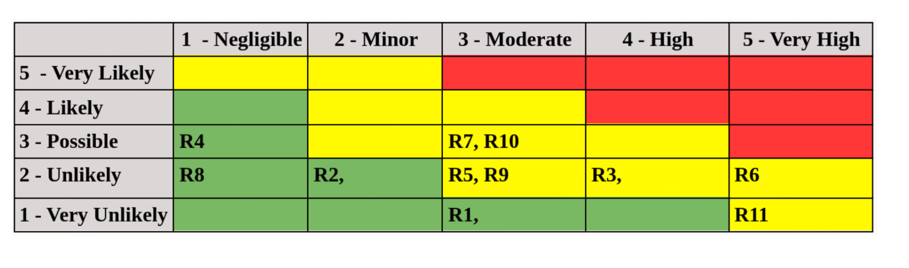

# Test Design for munchora-server-relational-db

This document outlines the design techniques and testing process for the **_Munchora_** application.

The core functionalities of **_Munchora_** have been prioritized to achieve high test coverage for these following
domains:

- **MODELS**
    - _GroceryList_
    - _GroceryListItem_
    - _User_
- **Requests**
    - _auth_controller_
    - _grocery_lists_controller_
    - _users_controller_
- **Services**
    - _**grocery_lists**_
        - _creator_
        - _item_manager_
        - _sharer_

---

## Table of Contents

- [Acceptance tests](#Acceptance-tests)
- [System tests / End-to-end tests](#System-tests--End-to-end-tests)
    - [Stress Performance Testing](#stress-performance-testing)
    - [End-to-end Tests](#End-to-end-tests)
- [Integration tests](#Integration-tests)
- [Black Box Design Techniques](#black-box-design-techniques)
    - [User model](#user-model)
        - [Equivalence Partitions](#equivalence-partitions)
        - [3-value Boundary Value Analyse](#3-value-boundary-value-analyse)
- [White Box Design Techniques](#white-box-design-techniques)
    - [User creation / User initialize](#user-creation--user-initialize)
        - [Test cases 100% statement coverage](#test-cases-100-statement-coverage)
        - [Test cases 100% decision coverage](#test-cases-100-decision-coverage)
- [CI pipeline](#ci-pipeline)
    - [Rubocop](#rubocop)
    - [SonarQube](#sonarqube)
- [Risk Analysis](#risk-analysis)
- [MISC](#misc)

---

<br>

# Acceptance tests

Real users...

Test templates

Check
Arturo's [Acceptance Test checklist](https://github.com/arturomorarioja-ek/SD_Testing_E25/blob/main/Lesson07/Acceptance%20Test%20checklist.xlsx)

Check
Arturo's [Test Case template](https://github.com/arturomorarioja-ek/SD_Testing_E25/blob/main/Lesson07/Test%20Case%20template.xlsx)

---

<br>

# System Tests

Testing Munchora's system by using **Cypress** for _E-2-E tests_ and **Apache JMeter** for _performance stress testing_ to
evaluate the application's resilience and its ability to handle multiple concurrent requests.

## Stress Performance Testing

Using Apache JMeter for setting up:

**Stress Testing** &rarr; Push system beyond normal limits to find breaking points

**Load testing** &rarr; Verify system performance under expected normal-to-peak load (the implementation is expecting middle input)

**Spike testing** &rarr; Test system response to sudden, massive traffic surges

```bash
# Ensure to be positioned at ./jmeter-tests/
# run stress tests
jmeter -n -t stepping_thread_group_stress_test.jmx -l results/load_results.jtl -e -o reports/load_test

# run load tests
jmeter -n -t load_test.jmx -l results/load_results.jtl -e -o reports/load_test

# run spike tests
jmeter -n -t spike_test.jmx -l results/load_results.jtl -e -o reports/load_test
```

---

## End-to-end Tests

Cypress WHY CYPRESS - shared methods - scenarios

---

<br>

# Integration tests

london vs detroit approach

DB - sqlite3 - both london and detroit not hardly mocked not hardly integrated

Third part OAuth Google and OpenAI

The integration tests for `Api::V1::LlmController` uses London approach, since calling the `OpenAI API` for every test
would be costly and slow. Instead, the service layer is mocked to return a sample recipe, allowing to test controller
behavior and responses without hitting the real API.

---

<br>

# Black Box Design Techniques

Specification based.

## User model

The **User model** is managed by _ActiveRecord_ (_Ruby on Rails ORM_) and it defines the core data structure,
associations, and validations for _user accounts_, handling both _manual signup_ and _OAuth flows_ (currently only
_Google_), enforcing field formats and lengths, managing relationships, and customizing JSON output to exclude
sensitive data like **password_digest** and **email**.

### Equivalence Partitions

|                | Partition Types | Boundary Values             | Test case Values                                          |
|----------------|-----------------|-----------------------------|-----------------------------------------------------------|
| **email**      | invalid         | 0 - 6 _(string length)_     | `'t.d'`,                                                  |
|                | valid           | 6 - 100 _(string length)_   | `'johnUser_232@test.dk'`,                                 |
|                | invalid         | \> 100  _(string length)_   | `'a'*200 + '@example.com'`                                |
|                |                 |                             |                                                           |
| **first_name** | valid           | 2 - 60 _(string length)_    | `Maximilian`,                                             |
|                | invalid         | \> 60 _(string length)_     | `'A' * 200`                                               |
|                |                 |                             |                                                           |
| **last_name**  | valid           | 2 - 60 _(string length)_    | `Wolfeschlegelsteinhausenbergerdorff`,                    |
|                | invalid         | \> 60 _(string length)_     | `'A' * 200`                                               |
|                |                 |                             |                                                           |
| **bio**        | valid           | 0 - 2_000 _(string length)_ | `'I like AI food'*15`                                     |
|                | invalid         | \> 2_000 _(string length)_  | `'I like to cook with AI'*500`                            |
|                |                 |                             |                                                           |
| **uid**        | valid           | 0 - 100 _(string length)_   | `xoheuif3qr3`                                             |
|                | invalid         | \> 100 _(string length)_    | `'u'*450`                                                 |
|                |                 |                             |                                                           |
| **provider**   | valid           | 0 - 40 _(string length)_    | `apple`                                                   |
|                | invalid         | \> 40 _(string length)_     | `'a'*100`                                                 |
|                |                 |                             |                                                           |
| **password**   | invalid         | 0 - 6 _(string length)_     | `psw`,                                                    |
|                | valid           | 6 - 50 _(string length)_    | `superSecPsw!a31b_qwe0#`                                  |
|                | invalid         | \> 50 _(string length)_     | `'p'*100`                                                 |
|                |                 |                             |                                                           |
| **image_src**  | invalid         | 0 - 14 _(string length)_    | `http://s.d`,                                             |
|                | valid           | 14 - 400 _(string length)_  | `https://munchora.pro/uploads/recipes/3r93xhue938383.jpg` |
|                | invalid         | \> 400 _(string length)_    | `'http://img.dk/uploads/' + 'x'*778 (800)`                |

---

<br>

### 3-value Boundary Value Analyse

| Field          | Boundary Condition          | Boundary Values | 3 Test Case Values (below, on, above)                                                                                                      |
|----------------|-----------------------------|-----------------|--------------------------------------------------------------------------------------------------------------------------------------------|
| **email**      | 0 - 6 _(string length)_     | 0               | `''`, `'t'`                                                                                                                                |
|                | 6 - 100 _(string length)_   | 6               | `'u@t.d'`, `'u@t.dk'`, `'u1@t.dk'`                                                                                                         |
|                | 6 - 100 _(string length)_   | 100             | `'a'*87 + '@example.com' (99)`, `'a'*88 + '@example.com' (100)`, `'a'@89 + '@example.com' (101)`                                           |
|                |                             |                 |                                                                                                                                            |
| **first_name** | 0 - 2                       | 0               | `''`, `O`                                                                                                                                  |
|                | 2 - 60 _(string length)_    | 2               | `O`,  `Li`, `'Lee'`                                                                                                                        |
|                | 2 - 60 _(string length)_    | 60              | `'A'*59`, `'A'*60`, `'A'*61`                                                                                                               |
|                |                             |                 |                                                                                                                                            |
| **last_name**  | 0 - 2                       | 0               | `''`, `J`                                                                                                                                  |
|                | 2 - 60 _(string length)_    | 2               | `J`, `Jo`, `'Joe'`                                                                                                                         |
|                | 2 - 60 _(string length)_    | 60              | `'A'*59`, `'A'*60`, `'A'*61`                                                                                                               |
|                |                             |                 |                                                                                                                                            |
| **bio**        | 0 - 2_000 _(string length)_ | 0               | `''`, `'a'`                                                                                                                                |
|                | 0 - 2_000 _(string length)_ | 2000            | `'a'*1_999`, `'a'*2_000`, `'a'*2_001`                                                                                                      |
|                |                             |                 |                                                                                                                                            |
| **uid**        | 0 - 100 _(string length)_   | 0               | `''`, `'a'`                                                                                                                                |
|                | 0 - 100 _(string length)_   | 100             | `'a'*99`, `'a'*100`, `'a'*101`                                                                                                             |
|                |                             |                 |                                                                                                                                            |
| **provider**   | 0 - 40 _(string length)_    | 0               | `''`, `'u'`                                                                                                                                |
|                | 0 - 40 _(string length)_    | 40              | `'u'*39`, `'u'*40`, `'u'*41`                                                                                                               |
|                |                             |                 |                                                                                                                                            |
| **password**   | 0 - 6 _(string length)_     | 0               | `'',  `'p'`                                                                                                                                |
|                | 6 - 50 _(string length)_    | 6               | `'secpw'`, `'secpsw'`, `'secpswd'`                                                                                                         |
|                | 6 - 50 _(string length)_    | 50              | `'p'*49`, `'p'*50`, `'p'*51`                                                                                                               |
|                |                             |                 |                                                                                                                                            |
| **image_src**  | 0 - 14 _(string length)_    | 0               | `''`, `'h'`                                                                                                                                |
|                | 14 - 400 _(string length)_  | 14              | `'http://img.dk' (13)`, `'http://img.dk/' (14)`, `'http://img.dk/1' (15)`                                                                  |
|                | 14 - 400 _(string length)_  | 400             | `'http://img.dk/uploads/' + 'x'*377 (399)`,<br/>`'http://img.dk/uploads/' + 'x'*378 (400)`,<br/>`'http://img.dk/uploads/' + 'x'*379 (401)` |

---

<br>

### Edge Cases

This outlines the field-level test cases for the **User model**, specifying expected formats and example invalid
values to ensure robust validation against **incorrect types**, **malformed emails**, and **invalid URLs**.

| Field          | Format                         | Test Case Value                                                                              |
|----------------|--------------------------------|----------------------------------------------------------------------------------------------|
| **email**      | `URI - :mailto`                | `null`, `plainaddress`, `@missinguser.com`, `user@.com`, `user@com,com`, `user@exa mple.com` |
| **first_name** | `UTF-8 encoded Unicode` string | `wrong data types`                                                                           |
| **last_name**  | `UTF-8 encoded Unicode` string | `wrong data types`                                                                           |
| **bio**        | `UTF-8 encoded Unicode` string | `wrong data types`                                                                           |
| **uid**        | `UTF-8 encoded Unicode` string | `wrong data types`                                                                           |
| **provider**   | `UTF-8 encoded Unicode` string | `wrong data types`                                                                           |
| **password**   | `UTF-8 encoded Unicode` string | `wrong data types`                                                                           |
| **image_src**  | `URI - :http/https`            | `a.com`, `invalid_url`, `http://a.co`, `htp://site.com/uploads/x.jpg`                        |

---

<br>

### Decision table

This table summarizes the key conditions and expected outcomes for **user creation**, covering both _manual signup_
and _OAuth flows_, and highlights which combinations of field validity result in a successful account creation.

| **User model**                  | **R1**        | **R2**        | **R3**        | **R4**        | **R5**       | **R6**       | **R7**       | **R8**       |
|---------------------------------|---------------|---------------|---------------|---------------|--------------|--------------|--------------|--------------|
| **Conditions**                  |               |               |               |               |              |              |              |              |
| Email & names valid?            | F             | T             | F             | T             | F            | T            | F            | T            |
| Password valid?                 | F             | F             | T             | T             | /            | /            | /            | —            |
| Provider & uid present?         | /             | /             | /             | /             | F            | F            | T            | T            |
| Image_src valid?                | /             | /             | /             | /             | /            | /            | /            | /            |
| Bio valid?                      | /             | /             | /             | /             | /            | /            | /            | /            |
| **Expected Validation Context** | Manual signup | Manual signup | Manual signup | Manual signup | OAuth signup | OAuth signup | OAuth signup | OAuth signup |
| **Actions**                     |               |               |               |               |              |              |              |              |
| User created (valid)?           | ❌             | ❌             | ❌             | ✅             | ❌            | ❌            | ❌            | ✅            |

---

<br>

# White Box Design Techniques

Focuses on the code and the structural elements.

---

**Statement Coverage**: Measures whether each line of code has been executed by the test suite at least once.
**decision coverage**: Measures whether **each decision (true/false outcome) of every conditional statement** has been
exercised at least once.

## User creation | User #initialize

### Test cases 100% statement coverage

```text
#1. first_name="John", last_name="Doe", email="john@doe.com", provider=nil, uid=nil, password="secret123"
    # TRUE path provider.blank? & TRUE :password is_a?(String)
    
#2. first_name="John", last_name="Doe", email="john@doe.com", provider="google", uid="abc123", password=nil
    # TRUE branch of both provider.present? and uid.present?
```

### Test cases 100% decision coverage

```text
#1. first_name="John", last_name="Doe", email="john@doe.com", provider=nil, uid=nil, password="secret123"
    # TRUE path for provider.blank? and TRUE for :password is_a?(String)

#2. first_name="John", last_name="Doe", email="john@doe.com", provider=nil, uid=nil, password=1234
    # FALSE branch of :pasword is_a?(String)

#3. first_name="John", last_name="Doe", email="john@doe.com", provider="google", uid=nil, password=nil
    # FALSE branch of uid.present? when provider.present?

#3. first_name="John", last_name="Doe", email="john@doe.com", provider="google", uid="abc123", password=nil
    # TRUE branch of both provider.present? and uid.present?
```

---

<br>

# CI pipeline

4 different flows defined

1. **E2E Tests**
    - **_cypress_**: end-to-end tests with cypress
2. **Lint**
    - **_rubocop_**: ensuring linting
3. **Security Checks**
    - **_brakeman_**: check for known vulnerabilities based on Gemfile
4. Tests
    - rspec: running all specs

### Brakeman

Brakeman action caught a
vulnerability [CVE-2025-61594 - URI Credential Leakage Bypass over CVE-2025-27221](https://github.com/realkoder/soft-dev-02-databases/actions/runs/18355733587/job/52287122522)

---

<br>

# Static Testing

## Rubocop

Linting and style enforcement. Rules are defined in `./munchora-server-relational-db/.rubocop.yml`.

```
# analyze project
bundle exec rubocop

# Run analyzer and make rubocop automatically fix linting issues
bundle exec rubocop -a
```

---

## SonarQube

[SonarQube](https://www.sonarsource.com/) a _static code analysis tool_ that automatically inspects code for bugs,
vulnerabilities, code smells, and test coverage without running the program.

[SonarQube can be run through the use of Docker](https://medium.com/@index23/start-sonarqube-server-and-run-analyses-locally-with-docker-4550eb7112a3)

```bash
cd munchora-server-relational-db
docker-compose -f docker-compose-sonar-qube.yml up
```

Go to **SonarQube dashboard** on `http://localhost:9000` - default credentials are login: `admin` password: `admin`

Use following command to scan project with _SonnarScanner_:

```bash
docker run \
    --rm \
    -v "$(pwd):/usr/src" \
    --network="host" \
    -e SONAR_HOST_URL="http://localhost:9000" \
    -e SONAR_SCANNER_OPTS="-Dsonar.projectKey=munchora-server-relational-db -Dsonar.sources=./ -Dsonar.test=test -Dsonar.javascript.lcov.reportPaths=test/coverage/lcov.info" \
    -e SONAR_TOKEN="${SONAR_TOKEN}" \
    sonarsource/sonar-scanner-cli
```

---

<br>

# Risk Analysis

For inspiration checkout hand-ins for Risk Analysis on teams within Test room

**Prob**: 1 (low), 5 (_high_)

**Impact**: 1 (_low_), 5 (_high_)

**Factor** = _Prob_ __*__ _Impact_

| ID  | Name                        | Description                                                                                                                                             | Prob | Impact | Risk Factor | Mitigation                                                                                                                                         | Responsible           | Status Date | Follow-up Date | Status  |
|-----|-----------------------------|---------------------------------------------------------------------------------------------------------------------------------------------------------|------|--------|-------------|----------------------------------------------------------------------------------------------------------------------------------------------------|-----------------------|-------------|----------------|---------|
| R1  | **Technical & Operational** | **System Outages & Performance Issues**: The site goes down or is unusably slow. User grocery lists are lost or corrupted.                              | 4    | 4      | 16          | Implement monitoring (any bottlenecks). Horizontal/vertical scaling.                                                                               | Alexander Christensen | 2025-11-4   | Weekly         | Initial |
| R2  | **Technical & Operational** | **Solo Project**: Munchora is unavailable due to illness, burnout, or other reasons. The project grinds to a halt.                                      | 4    | 3      | 12          | Well structured code base and architecture. Using versioning control (git), clear commit messages. _CI/CD pipeline_.                               | Alexander Christensen | 2025-11-4   | Weekly         | Initial |
| R3  | **Technical & Operational** | **Technical Debt & Scalability**: Quick ad-hoc fixes accumulate, making the codebase unmaintainable.                                                    | 3    | 5      | 15          | Well structured code base and architecture. Using versioning control (git), clear commit messages. Coding standards and principles (DRY, SOLID).   | Alexander Christensen | 2025-11-4   | Weekly         | Initial |
| R4  | **Security & Privacy**      | **Data Breach & Privacy Failure**: User data (emails, passwords, shopping lists) is exposed. GDPR/Privacy violation.                                    | 4    | 3      | 12          | Never store plain-text passwords. Regular dependency vulnerability scanning (brakeman). Use HTTPS. Have a clear, simple Privacy Policy.            | Alexander Christensen | 2025-11-4   | Weekly         | Initial |
| R5  | **Security & Privacy**      | **API Key Compromise**: Keys for the AI service, database, or email service leaked -> unauthorized use and large bills.                                 | 3    | 5      | 15          | Never hardcode API keys. Use environment variables.                                                                                                | Alexander Christensen | 2025-11-4   | Weekly         | Initial |
| R6  | **Security & Privacy**      | **Injection & XSS Attacks**: Malicious code is injected into shared lists or recipes, affecting other users.                                            | 3    | 3      | 9           | Parameterized queries for database access. Sanitize and validate all user input on the backend.                                                    | Alexander Christensen | 2025-11-4   | Weekly         | Initial |
| R7  | **Business & Legal**        | **AI-Generated Content Liability**: AI generates a recipe that is harmful and a user gets sick.                                                         | 5    | 2      | 10          | Prominently Terms of Service and conditions: "AI-generated recipes are suggestions. only Always use your judgment regarding food safety..."        | Alexander Christensen | 2025-11-4   | Weekly         | Initial |
| R8  | **Business & Legal**        | **Intellectual Property Infringement**: AI generates a recipe that is a near-copy of a copyrighted recipe from a famous chef or website.                | 3    | 3      | 9           | A clear Terms of Service stating users are responsible for the content they generate and that the platform is a tool, not a publisher, is crucial. | Alexander Christensen | 2025-11-4   | Weekly         | Initial |
| R9  | **Business & Legal**        | **Monetization & Financial Failure**: Project cannot cover its costs (API fees, hosting).                                                               | 4    | 4      | 16          | Calculate precisely monthly costs. Limit user signups and recipe generations.                                                                      | Alexander Christensen | 2025-11-4   | Weekly         | Initial |
| R10 | **Product & Market**        | **Low User Adoption / Product-Market Fit**: The app doesn't solve a real problem effectively enough to attract and retain users.                        | 5    | 5      | 25          | Talk to potential users before and during development. Prepared to pivot features based on feedback.                                               | Alexander Christensen | 2025-11-4   | Weekly         | Initial |
| R11 | **Product & Market**        | **Scope creep - User Onboarding & UX Failure**: Munchora is confusing, too many features, and users don't understand how to use the AI or shared lists. | 3    | 4      | 12          | Build a clean, intuitive UI. Use analytics to see where users drop off.                                                                            | Alexander Christensen | 2025-11-4   | Weekly         | Initial |

Create and add a table similar to this:



---

<br>

# MISC

Simplecov for test coverage analyze

Defined in `./munchora-server-relational-db/spec/rails_helper.rb`

```ruby
require 'simplecov'

SimpleCov.start do
  # Track only the User model
  track_files "app/models/user.rb"

  # Optionally, ignore everything else
  add_filter do |source_file|
    !source_file.filename.end_with?("app/models/user.rb")
  end
end
```

Just run specs `bundle exec rspec` and simplecov will also do its job - then check the coverage report after running,
_SimpleCov_ generates an HTML report in `./munchora-server-relational-db/coverage/index.html` showing line-by-line
coverage and totals.
